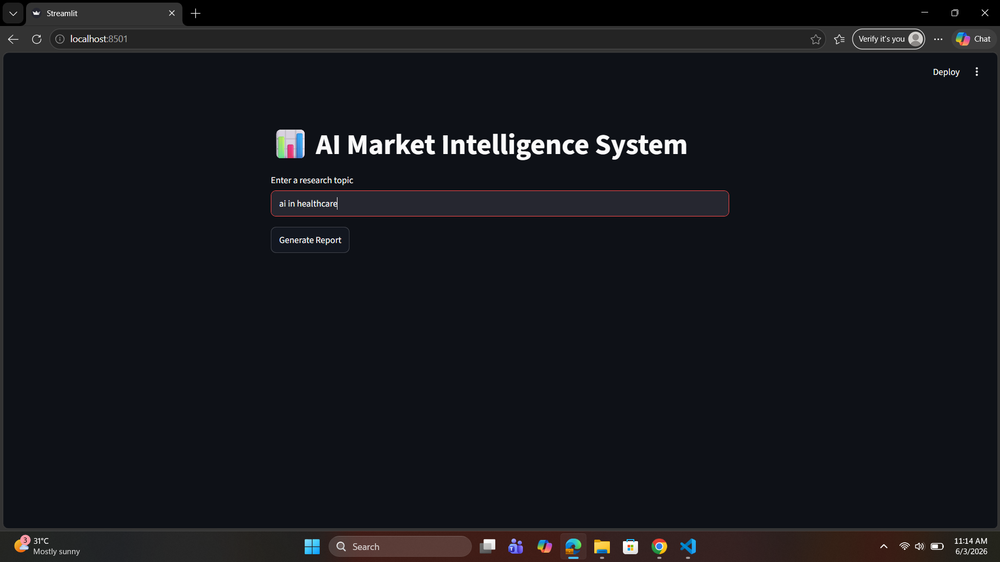
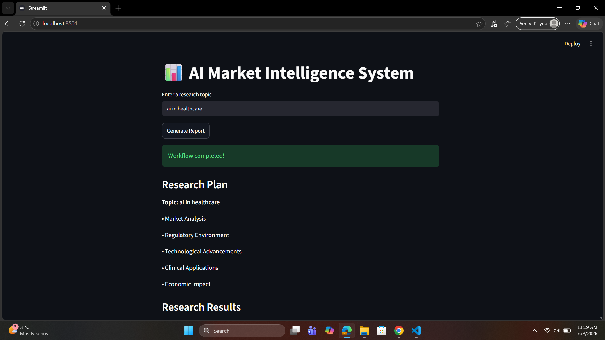

# AI Market Intelligence System

## Screenshots

### Home Page



### Report Generation



### Verification, Review & Export


## Overview

AI Market Intelligence System is a multi-agent research platform that automates market analysis using Large Language Models (LLMs), web search, and vector memory.

The system generates structured market intelligence reports by combining:

* Research Planning
* Web Search & Data Collection
* Research Verification
* Report Generation
* Report Review & Scoring
* Persistent Memory Storage

---

## Features

### Multi-Agent Workflow

The system uses specialized agents:

* Planner Agent

  * Creates a research plan and sections

* Researcher Agent

  * Collects information from web sources using Tavily

* Verifier Agent

  * Validates research quality and completeness

* Writer Agent

  * Generates professional market intelligence reports

* Reviewer Agent

  * Evaluates report quality and assigns a score

---

### Memory Layer

* ChromaDB Vector Database
* Stores generated reports
* Enables future semantic search and retrieval

---

### Report Export

Generated reports are automatically saved to:

```text
outputs/reports/
```

---

### Web Interface

Built with Streamlit for easy interaction.

Users can:

* Enter a research topic
* Generate reports
* View research notes
* Download reports

---

## Architecture

```text
User
 │
 ▼
Streamlit UI
 │
 ▼
Workflow Engine
 │
 ├── Planner Agent
 ├── Researcher Agent
 ├── Verifier Agent
 ├── Writer Agent
 ├── Reviewer Agent
 │
 ▼
Export Tool
 │
 ▼
ChromaDB Memory
```

---

## Tech Stack

### Backend

* Python
* FastAPI

### Frontend

* Streamlit

### AI Models

* Groq LLMs

### Search

* Tavily Search API

### Memory

* ChromaDB

### Testing

* Pytest

---

## Project Structure

```text
market_intelligence/

├── agents/
├── tools/
├── memory/
├── graph/
├── api/
├── frontend/
├── config/
├── tests/
├── outputs/
├── .env
├── requirements.txt
└── README.md
```

---

## Installation

Clone the repository:

```bash
git clone <repository-url>
cd market_intelligence
```

Install dependencies:

```bash
pip install -r requirements.txt
```

Create a `.env` file:

```env
GROQ_API_KEY=your_key
TAVILY_API_KEY=your_key
```

---

## Run Streamlit

```bash
streamlit run frontend/app.py
```

---

## Run FastAPI

```bash
uvicorn api.main:app --reload
```

---

## Run Tests

```bash
pytest tests -v
```

---

## Sample Workflow

1. User enters a topic
2. Planner creates research sections
3. Researcher gathers information
4. Verifier checks quality
5. Writer generates report
6. Reviewer scores report
7. Report is exported
8. Report is stored in ChromaDB

---

## Future Improvements

* React Frontend
* LangGraph Integration
* PDF Report Export
* Report History Dashboard
* Semantic Report Search
* Multi-User Authentication

---

## Author

Thanvi Reddy

AI / Machine Learning Projects
